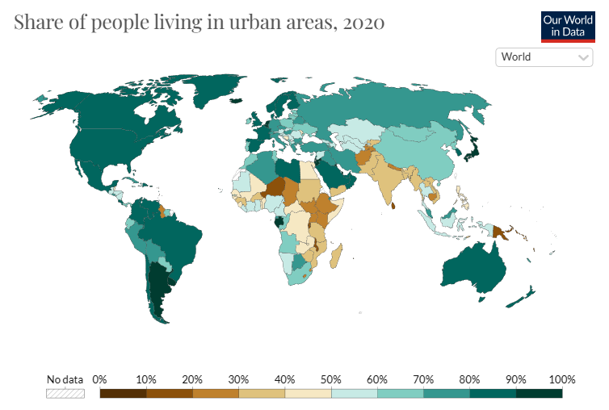
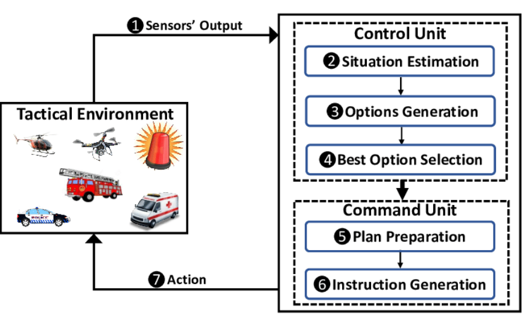
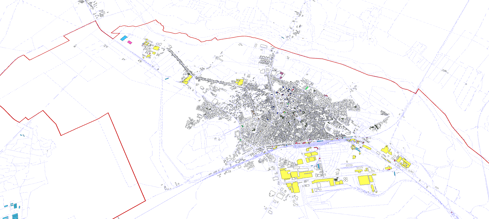
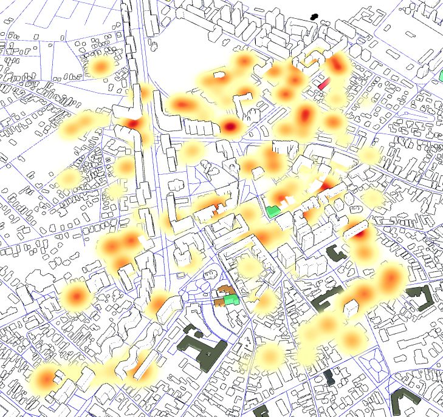
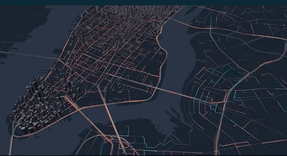
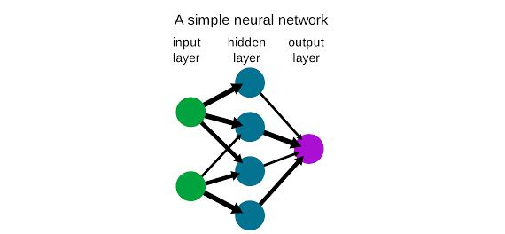

# WHITEPAPER: SKYLINES

| [Ioan-Paul Niculae](https://) | [Calin-Mihai Toader](https://) |

<center>


</center>

# **INTRODUCERE**

# **DEFINITII**

## SKYLINES

> Soluția propusă consta intr-un sistem de informare la nivelul orașului care poate ajuta oficialii orașului să identifice tendințe și modele în date (modele de trafic, utilizare a energiei etc.).In timp, poate ajuta la automatizarea serviciilor unui oras, luarea deciziilor și dezvoltarea politicilor. În plus, poate fi utilizat pentru a îmbunătăți transparența și responsabilitatea, deoarece cetățenii pot avea acces controlat la datele sistemului pentru a vedea cum progreseaza orașul in care traiesc în diferite domenii si situatii.

## SMART CITY

> Un oraș inteligent este un oraș care folosește tehnologia și datele pentru a îmbunătăți calitatea vieții cetățenilor și eficiența operațiunilor sale. Orașele inteligente folosesc o varietate de tehnologii, cum ar fi senzori, analize de date, IoT, pentru a colecta și analiza date despre infrastructura, serviciile și activitățile orașului. Această informație este apoi utilizată pentru a lua decizii mai bine informate și pentru a optimiza performanța sistemelor și serviciilor orașului.

## IoT

> Internet of Things (IoT) se referă la conexiunea și comunicarea dintre dispozitivele fizice sau obiectele de zi cu zi (cum ar fi autovehicule, senzori etc.) prin intermediul Internetului. Aceste dispozitive sunt dotate cu tehnologie de comunicație și de procesare a informațiilor, ceea ce le permite să comunice între ele și să ofere informații utile utilizatorilor sau altor sisteme. Scopul principal al IoT este de a îmbunătăți eficiența și productivitatea în diferite domenii, cum ar fi industria, sănătatea, transportul și multe altele.

## Sistem de transport inteligent

> ITS este o rețea de tehnologii și sisteme care folosesc senzori, analiza de date și alte tehnologii pentru a monitoriza și gestiona sistemele de transport, incluzând drumuri, autostrăzi, transport public și gestionarea traficului.

## Senzori

> Acestea sunt dispozitivele care sunt utilizate pentru a colecta date din mediul sau sistemul monitorizat. Senzorii pot fi conectați direct la sistemul de achiziție de date sau pot fi conectați la un dispozitiv la distanță care transmite datele printr-un sistem fără fir.

## Hardware-ul de achiziție de date

> Acesta este hardware-ul utilizat pentru a conecta senzorii la sistemul de achiziție de date și pentru a colecta datele de la senzori. Hardware-ul de achiziție de date poate include registratoare de date, convertizoare analog-digital și alte tipuri de hardware.

## Software-ul de achiziție de date

> Acesta este software-ul care este utilizat pentru a configura sistemul de achiziție de date, a colecta datele de la senzori și a stoca datele pentru analiză ulterioară. Software-ul de achiziție de date poate include biblioteci software, drivere și alte instrumente.

## Infrastructura de comunicație

> Aceasta este hardware-ul și software-ul care este utilizat pentru a transmite datele de la senzori la sistemul de achiziție de date. Infrastructura de comunicație poate include rețele cu fir sau fără fir, protocoale de comunicație și alte componente.

## Stocarea si analiza datelor

> Acesta este hardware-ul și software-ul care sunt utilizate pentru a stoca datele pentru o analiză ulterioară și pentru a procesa datele pentru a extrage informații. Stocarea și analiza datelor pot include sisteme de baze de date, sisteme de depozitare a datelor și unelte de analiză a datelor.

## Sisteme de control şi comandă

> Sisteme utilizate pentru a gestiona și controla alte sisteme complexe, precum uzinele de fabricație, rețelele de energie și rețelele de transport.

## Osmium

> Osmium este un instrument de linie de comandă special conceput pentru a lucra cu date OpenStreetMap. Include multe funcții utile pentru manipularea datelor OSM și, adesea, ofera mai multe beneficii fata de alte instrumente similiare.

## Rețele neurale

> Retele neurale sunt caracterizate ca fiind un  tip de algoritm de învățare automată si pot fi utilizate pentru a ajuta la detectarea unui spectru larg de incidente.

# **De ce orașe inteligente?**

Orasele inteligente utilizeaza tehnologia și date pentru a îmbunătăți calitatea vieții cetățenilor și pentru a face zonele urbane mai eficiente și durabile. Există multe avantaje potențiale ale creării unui oraș inteligent, inclusiv:

- **Îmbunătățirea serviciilor publice**: Orasele inteligente pot folosi datele și tehnologia pentru a îmbunătăți livrarea serviciilor publice, precum sănătatea, educația și transportul public.
- **Dezvoltarea economica**: Orașele inteligente pot imbunatatii sistemul de afaceri și investiții, pot atrage angajați bine pregatiti in domeniul lor, oferind o infrastructură modernă și eficientă.
- **Calitatea vietii**: Orasele inteligente pot folosi tehnologia și datele pentru a îmbunătăți siguranța, sănătatea și binele cetățenilor.
- **Sustenabilitatea**: Orasele inteligente pot folosi tehnologia pentru a reduce impactul asupra mediului și a deveni mai durabile.

# **CONTEXTUL ACTUAL**

Noile probleme globale necesită cooperare și inovare, dar sistemele nu au inovat. Există o dificultate reală de accesare a datelor publice de către cetățeni și de către lucratorii publici și există o lipsă de date, date care pot fi analizate și utilizate in vederea îmbunătățiri anumitor servicii urbane.

Se estimează că populația urbană globală va continua să crească semnificativ între 2020 și 2050. Potrivit Națiunilor Unite, se așteaptă ca populația urbană să crească cu aproximativ 2,5 miliarde de oameni între 2020 și 2050, cu aproape 90% din creștere având loc în Asia și Africa. Până în 2050, se estimează că aproximativ 68% din populația globală va locui în zone urbane, față de aproximativ 55% în 2020.

<center>



</center>

Această urbanizare rapidă este influentata de mai mulți factori, inclusiv creșterea populației, migrația rural-urbană și extinderea orașelor existente. Pe măsură ce mai mulți oameni se mută în zone urbane, este important ca aceste orașe să fie bine pregatite și echipate pentru a face față populației suplimentare și necesităților infrastructurii conexe.

Există mai multi factori potențiali care pot afecta un oraș în urma unei urbanizări rapide:

- **Degradarea mediului**: Urbanizarea poate avea, de asemenea, impact negativ, cum ar fi degradarea mediului, deoarece extinderea orașelor implică adesea pierderea habitatelor naturale și creșterea utilizării resurselor naturale.

- **Congestia traficului și poluarea aerului**: Urbanizarea poate duce la creșterea congestiei rutiere și a poluării aerului, deoarece mai mulți oameni și vehicule acapareaza suprafata orașului.

_Cum putem îmbunătăți acesta situatie?_

Este de obicei imposibil să se oprească complet urbanizarea, deoarece este un proces natural condus de o serie de factori, incluzând creșterea populației, dezvoltarea economică și dorința de a avea o calitate mai bună a vieții. Cu toate acestea, există modalități de a gestiona urbanizarea și de a aborda impacturile sale negative:

- **Infrastructura sustenabila**: Orasele pot investi în infrastructură durabilă, precum clădiri eficiente energetic și surse de energie regenerabilă, pentru a reduce impactul lor asupra mediului.
- **Transport public**: Orasele pot investi în sisteme de transport public, precum autobuze, trenuri și programe de bike sharing, pentru a reduce congestia traficului și a îmbunătăți mobilitatea.
- **Dezvoltarea inteligenta**: Orasele pot adopta politici de dezvoltare inteligentă care să se concentreze pe dezvoltarea compactă, ușor de parcurs și orientată către transportul public, care pot reduce impacturile negative ale urbanizării, cum ar fi aglomerația rutieră și extinderea fără sens.

# **VIZIUNEA NOASTRA**

Ne dorim ca majoritatea orașelor să aibă o creștere economică mai bună, o mobilitate urbană mai eficientă, o calitate a vieții mai bună pentru cetățeni si o dezvoltare durabilă, toate prin utilizarea unei tehnologii robuste. Soluția noastră va urmări să îmbunătățească operațiunile pentru sistemele de control și comandă, cu scopul tranziției de la C1 la C2 sau mai mult.

Sistemele de control sunt utilizate pentru a monitoriza şi controla funcţionarea unui sistem în timp real. Acestea utilizează senzori pentru a colecta date despre funcţionarea sistemului şi utilizează aceste date pentru a ajusta comportamentul sistemului în scopul obţinerii unui rezultat dorit.

**C1**, **C2**, si alti termeni similari sunt adesea utilizați pentru a clasifica sistemele de control și comandă în funcție de nivelul de complexitate și autonomie pe care le oferă.

**C1** Sistemele de nivel C1 sunt cele mai simple sisteme de control şi comandă. Acestea sunt de obicei sisteme manuale care necesită un operator uman pentru a controla şi monitoriza manual sistemul.

**C2** Sistemele C2 sunt mai avansate decât sistemele C1 și oferă un anumit nivel de automatizare și/sau asistență computerizată operatorului. Pot include caracteristici precum colectarea automată a datelor și analiză, sau capacitatea de a executa sarcini programate în prealabil.

**C3** Sistemele C3 sunt mai complexe și mai autonome decât sistemele C2. Ele sunt capabile să ia decizii singure și pot include caracteristici precum algoritmi de învățare automată, care le permit să se adapteze la condiții în schimbare.

**C4** Sistemele de tip C4 sunt cele mai avansate sisteme de control și comandă. Acestea sunt sisteme complet autonome, capabile să funcționeze fără intervenția umană.

Aceste categorii sunt utilizate în general pentru a descrie nivelul de complexitate și autonomie al sistemelor de control și comandă, cu sistemele **C1** fiind cele mai simple și sistemele **C4** fiind cele mai avansate.

Specific, un sistem de control poate fi utilizat pentru a regla temperatura unui proces de fabricație sau pentru a ajusta fluxul de electricitate într-o rețea de energie. Există multe scenarii care pot fi automatizate într-un oraș inteligent, deoarece utilizarea tehnologiei și a datelor poate ajuta la optimizarea unei largi game de operațiuni și servicii ale orașului. Iată câteva scenarii care pot fi automatizate într-un oraș inteligent:

- **Gestionarea traficului**: Orasele inteligente pot utiliza senzori și analiza de date pentru a monitoriza și gestiona fluxul de trafic, ajustând semafoarele de trafic și alte elemente ale sistemului de transport în timp real pentru a optimiza fluxul de trafic și a reduce congestia.
**Transportul public**: Orasele inteligente pot utiliza senzori și analiza de date pentru a optimiza traseele și programul sistemelor de transport public, cum ar fi autobuzele și trenurile, pentru a îmbunătăți eficiența și a reduce timpii de așteptare.
- **Gestionarea energiei**: Orasele inteligente pot utiliza senzori și analize de date pentru a monitoriza și optimiza utilizarea energiei, precum prin controlarea iluminatului și a încălzirii în clădiri publice sau prin ajustarea producției surselor de energie regenerabile, precum panourile solare sau turbinele eoliene.
- **Gestionarea deseurilor**: Orasele inteligente pot utiliza senzori si analiza datelor pentru a optimiza colectarea si procesarea deseurilor, cum ar fi prin rutarea mai eficienta a camioanelor de deseuri sau prin automatizarea sortarii si reciclarii materialelor.
- **Siguranța publică**: Orasele inteligente pot utiliza senzori si analize de date pentru a monitoriza si raspunde incidentelor legate de siguranta publica, precum incendii, accidente sau infractiuni, si pentru a optimiza deplasarea resurselor de raspuns in caz de urgenta.
**Sistemul de sanatate**: Orasele inteligente pot utiliza senzori si analize de date pentru a monitoriza si optimiza livrarea serviciilor de sanatate, precum prin automatizarea programarii de consultatii sau a comenzii de medicamente.

- **Gestionarea cladirilor**: Orasele inteligente pot utiliza senzori si analiza de date pentru a optimiza gestionarea cladirilor, cum ar fi prin automatizarea controlului sistemelor de iluminat, incalzire si securitate, sau prin monitorizarea si gestionarea utilizarii energiei.
- **Servicii guvernamentale**: Orașele inteligente pot folosi senzori și analiza datelor pentru a optimiza furnizarea de servicii guvernamentale, cum ar fi prin automatizarea procesării aplicațiilor și solicitărilor sau prin furnizarea de actualizări și informații în timp real cetățenilor.

De asemenea, un oraș inteligent poate folosi tehnologia pentru a automatiza semafoarele pentru a optimiza răspunsul la un incident. Acest lucru se poate face folosind senzori și analize de date pentru a monitoriza condițiile de trafic în timp real și pentru a ajusta sincronizarea semafoarelor în consecință.

De exemplu, dacă are loc un accident sau alt incident pe o anumită porțiune de drum, senzorii pot detecta aglomerația crescută a traficului și pot ajusta sincronizarea semafoarelor pentru a acorda mai mult timp vehiculelor să treacă prin zona afectată. Acest lucru poate ajuta la reducerea întârzierilor și la îmbunătățirea fluxului de trafic, precum și la îmbunătățirea siguranței prin reducerea la minimum a riscului de accidente suplimentare.

**Acest tip de scenarii pot fi automatizate** folosind un **sistem de transport inteligent (ITS)**

##### Arhitectura unui ITS include de obicei următoarele componente:

- **Senzori**: Acestea sunt dispozitive care sunt instalate în rețeaua de transport pentru a colecta date despre condițiile de trafic, cum ar fi volumul traficului, viteza și tipul de vehicul. Senzorii pot include camere de trafic și alte tipuri de senzori.
- **Colectarea și gestionarea datelor**: Această componentă este responsabilă de colectarea și stocarea datelor generate de senzori într-o bază de date centrală sau un depozit de date(Data Warehouse).
- **Analiza datelor**: Această componentă folosește algoritmi și alte tehnici pentru a analiza datele colectate de senzori și pentru a genera perspective și sugestii pentru îmbunătățirea performanței sistemului de transport.
- **Comunicare și control**: Această componentă este responsabilă pentru transmiterea datelor și recomandărilor din componenta de analiză a datelor către părțile corespunzătoare, cum ar fi centrele de management al traficului sau operatorii de transport public. De asemenea, poate fi folosit pentru a controla semnalele de trafic și alte elemente ale sistemului de transport în timp real.
- **Interfața cu utilizatorul**: Această componentă oferă o interfață ușor de utilizat pentru utilizatori, cum ar fi managerii de trafic, operatorii de transport public și șoferii, pentru a accesa și interacționa cu sistemul.

Cu toate acestea, caracteristicile și capacitățile specifice ale sistemelor din fiecare categorie pot varia foarte mult în funcție de aplicația specifică.

<center>



</center>

## **COLECTAREA DATELOR**

### Arhitectura pentru colectarea datelor și gestionare unui sistem:

- **Surse de date**: Acestea sunt diverse surse de date care sunt colectate de sistem, cum ar fi senzori, baze de date sau API-uri.
- **Conectori de date**: Acestea sunt componentele care sunt responsabile pentru conectarea la sursele de date și extragerea datelor.Pot utiliza diverse protocoale și tehnologii, cum ar fi SQL, REST sau MQTT, pentru a se conecta la sursele de date.
- **Stocarea datelor**: Această componentă este responsabilă pentru stocarea datelor colectate de sistem. Poate folosi o varietate de tehnologii de stocare, cum ar fi o bază de date relațională, o bază de date NoSQL sau un data lake(depozit centralizat conceput pentru a stoca, procesa și securiza cantități mari de date structurate, semistructurate și nestructurate).
- **Transformarea datelor**: Această componentă este responsabilă de curățarea, formatarea și transformarea datelor colectate de sistem pentru a le face mai potrivite pentru analiză și raportare.
- **Accesul la date**: Această componentă este responsabilă pentru asigurarea accesului la datele stocate de sistem. Poate include API-uri, structuri/modele de acces specifice mediilor care stocheaza date, sau alte mecanisme pentru accesarea datelor.

În general, această arhitectură este concepută pentru a permite colectarea, stocarea și accesul eficient la date din diverse surse într-o locație centralizată. Acesta permite sistemului să proceseze și să analizeze datele pentru a extrage informații și a lua decizii informate.

### **Există mai mulți pași implicați în colectarea datelor senzorilor**:

**Alegerea senzorilor corespunzători**: Primul pas în colectarea datelor senzorilor este alegerea senzorilor care sunt adecvați pentru aplicație. Senzorii se regasesc într-o gamă largă de tipuri și dimensiuni, iar fiecare tip de senzor este potrivit pentru anumite tipuri de colectare de date. De exemplu, un senzor de temperatură ar fi o alegere bună pentru colectarea datelor de temperatură, în timp ce un senzor de presiune ar fi o alegere bună pentru colectarea datelor de presiune.

**Instalarea senzorilor**: Odată ce au fost aleși senzorii corespunzători, aceștia trebuie instalați în locația în care vor fi utilizați. Aceasta poate implica montarea fizică a senzorilor pe o structură sau dispozitiv sau încorporarea lor într-un sistem sau proces.

**Conectarea senzorilor la un sistem de achizitie de date**: Pentru a colecta date de la senzori, aceștia trebuie să fie conectați la un sistem de achiziție de date. Aceasta poate implica conectarea senzorilor la un înregistrator de date, computer sau alt dispozitiv care este capabil să colecteze și să stocheze datele.

**Configurarea sistemului de achiziție de date**: Sistemul de achiziție de date trebuie configurat pentru a colecta datele de la senzori. Acest lucru poate implica configurarea sistemului pentru a colecta date la intervale specifice sau pentru a declanșa colectarea datelor pe baza anumitor condiții.

**Colectarea datelor**: Odată ce senzorii și sistemul de achiziție de date sunt configurați, datele pot fi colectate. Acest lucru poate implica rularea sistemului pentru o anumită perioadă de timp sau colectarea continuă de date până când sistemul este oprit.

**Analiza datelor**: Odată ce datele au fost colectate, acestea pot fi analizate pentru a extrage informații și a lua decizii pe baza datelor. Aceasta poate implica utilizarea instrumentelor software pentru a vizualiza datele sau aplicarea tehnicilor de analiză statistică datelor.

Arhitectura unui sistem de achiziție de date se referă la designul și structura generală a sistemului, inclusiv componentele hardware și software care sunt utilizate pentru colectarea, procesarea și stocarea datelor.

#### **Una dintre cele mai comune arhitecturi ale sistemului de achiziție de date include următoarele componente**:

**Senzori**: Sunt dispozitivele care sunt folosite pentru a colecta date din mediul sau sistemul monitorizat. Senzorii pot fi conectați direct la sistemul de achiziție de date sau pot fi conectați la un dispozitiv de la distanță care transmite datele fără fir.

**Hardware de achiziție de date**: Acesta este hardware-ul care este folosit pentru a conecta senzorii la sistemul de achiziție de date și pentru a colecta datele de la senzori. Hardware-ul de achiziție de date poate include înregistratoare de date, convertoare analog-digitale și alte tipuri de hardware.

**Software de achizitie de date**: Acesta este software-ul care este utilizat in configurarea sistemului de achiziție de date, pentru a colecta datele de la senzori și pentru a stoca datele in vederea unei analize ulterioare. Software-ul de achiziție de date poate include biblioteci de software, drivere și alte instrumente.

**Infrastructura de comunicații**: Acesta este hardware-ul și software-ul care este folosit pentru a transmite datele de la senzori către sistemul de achiziție de date. Infrastructura de comunicații poate include rețele cu fir sau fără fir, protocoale de comunicație și alte componente.

**Stocarea și analiza datelor**: Acesta este hardware-ul și software-ul care sunt folosite pentru a stoca datele pentru o analiză ulterioară și pentru a procesa datele pentru a extrage informații. Stocarea și analiza datelor pot include sisteme de baze de date, sisteme de depozitare a datelor și instrumente de analiză a datelor.

În general, arhitectura unui sistem de achiziție de date este concepută pentru a permite colectarea, procesarea și stocarea eficientă și fiabilă a datelor dintr-o varietate de surse.

**Skylines** este soluția noastră pentru crearea unei interfete de vizualizare interactivă, bazate pe date, folosind diverse surse de date care sunt colectate de sistem. Este deosebit de potrivită pentru crearea si vizualizarea seturilor de date mari, cum ar fi datele geospațiale.

### **MANIPULAREA DATELOR**

#### **Colectarea datelor**

#### **Există mai multe moduri de colectare a datelor**:

**Colectarea datelor brute de la senzori**: primul pas în colectarea datelor despre senzori este colectarea datelor brute de la senzori. Aceasta poate implica utilizarea hardware sau software de achiziție de date pentru a colecta datele sau utilizarea protocoalelor de comunicație pentru a transmite datele fără fir.

**Accesarea datelor printr-un API**: implică de obicei efectuarea unei solicitări către API folosind o anumită adresă URL sau un endpoint final, împreună cu orice autentificare sau acreditări de autorizare necesare. API-ul va răspunde apoi cu datele solicitate, care pot fi în diferite formate, cum ar fi JSON, XML sau CSV.

#### **Procesarea datelor**

**Pre-procesarea datele brute**: în funcție de nevoile specifice ale aplicației, este posibil ca datele brute să fie pre-procesate pentru a le curăța sau a le transforma. Acest lucru poate implica eliminarea erorilor sau inconsecvențelor din date, agregarea datelor la un anumit nivel de detaliu sau aplicarea calculelor sau a altor transformări asupra datelor. **Skylines** folosește propriul mecanism personalizat de analiză care curăță și clasifică setul de date.

**Conversia datelor într-un format adecvat:** Este posibil ca datele să fie convertite într-un anumit format pentru a fi stocate sau transmise. De exemplu, este posibil ca datele să fie convertite într-un format binar, într-un fișier CSV sau într-un fișier JSON.

**Stocarea datele:** Datele pot fi apoi stocate într-o locație adecvată, cum ar fi o bază de date, un sistem de fișiere sau un serviciu de stocare în cloud.

**Analiza datele**: Odată ce datele au fost colectate și stocate, acestea pot fi analizate pentru a extrage informații și a lua decizii pe baza datelor. Aceast lucru implica utilizarea instrumentelor software pentru a vizualiza datele sau aplicarea tehnicilor de analiză statistică asupra datelor.

### **Prezentare generală**

#### Flux care ilustrează procesul pentru curățarea, formatarea și transformarea datelor OpenStreetMap (OSM) pentru a fi utilizate în Skylines:

- **Extragerea datelorm OSM**: primul pas în acest proces este extragerea datelor OSM relevante din baza de date OSM sau API. Acest lucru poate implica utilizarea filtrelor sau a interogărilor pentru a selecta anumite elemente de date, cum ar fi drumuri, clădiri sau puncte de interes.

- **Curățarea și filtrarea datelor**: următorul pas este curățarea și filtrarea datelor pentru a elimina orice elemente invalide sau inutile. Acest lucru implica identificarea și eliminarea datelor duplicate sau incorecte, precum și filtrarea datelor care nu sunt necesare pentru cazul specific de utilizare.

- **Transformarea datelor**: Următorul pas este transformarea datelor într-un format potrivit pentru utilizare în Skylines. Aceasta implica conversia datelor din formatul original (cum ar fi XML sau JSON) într-un format pe care Skylines îl poate înțelege, cum ar fi GeoJSON sau un format JSON personalizat.
- **Încărcarea datelor în Skylines**: pasul final este să încărcam datele transformate în Skylines folosind funcția de încărcare a datelor corespunzătoare, cum ar fi GeoJsonLayer sau ArcLayer. Datele pot fi apoi vizualizate și analizate în Skylines.

**Skylines** utilizează layere personalizate care sunt capabile să redea date GeoJSON, trecând datele OSM prin Osmium și permitand exportarea acestora în format GeoJSON. Acest lucru se poate face folosind unul dintre layerele geospațiale încorporate, furnizate de sistem.

Aplicația permite adăugarea mai multor layere la o hartă și fiecare layer reprezinta un fisier GeoJSON separat.Acestea sunt utilizate pentru codificarea unei varietăți de structuri de date geografice, inclusiv puncte, linii și poligoane.

Structura unui fișier reprezinta o colecție de perechi cheie-valoare, cheia fiind tipul de caracteristică și valoarea reprezentand proprietățile și geometria caracteristicii.

#### **Există mai multe tipuri de caracteristici GeoJSON**:

**Punct**: un singur punct de pe o hartă, reprezentat printr-un set de coordonate (longitudine și latitudine)

**LineString**: un set de două sau mai multe puncte care sunt conectate printr-o linie.

**Poligon**: un set de puncte care definesc o formă închisă.

**MultiPoint**: o serie de caracteristici Point.

**MultiLineString**: o serie de caracteristici LineString.

**MultiPolygon**: o serie de caracteristici Polygon.

```json
{
  // Polygon example:
  "type": "Feature",
  "geometry": {
    "type": "Polygon",
    "coordinates": [
      [
        [100.0, 0.0], // [x, y]
        [101.0, 0.0],
        [101.0, 1.0],
        [100.0, 1.0],
        [100.0, 0.0]
      ]
    ]
  },
  "features": [
    {
      "name": "Polygon"
      // ... relevant info
    }
  ]
}
```

Una dintre caracteristicile de bază ale **Skylines** este capacitatea de a genera **layere personalizate**, care pot fi folosite pentru a afișa date în diferite formate și stiluri.

Pentru a personaliza un layer Skylines, putem folosii sistemul de gestionare al layerelor. Unele opțiuni comune includ:

**date**: datele care urmează să fie afișate în layer, de obicei sub forma unei matrice de obiecte.

**getPosition**: O funcție care returnează poziția fiecărui punct de date, de obicei sub forma unei matrice de coordonate [longitudine, latitudine].

**getColor**: O funcție care returnează culoarea fiecărui punct de date, de obicei sub forma unei matrice de valori **[r, g, b, a]**.

**getRadius**: O funcție care returnează raza fiecărui punct de date, de obicei sub forma unui număr.

După ce ați creat un layer geospațial, puteți transmite datele GeoJSON la layer ca sursă de date. Layerul va procesa apoi datele și le va folosi pentru a crea componenta de vizualizare.

Pentru a vizualiza datele, puteți adăuga layerul la o componentă, împreună cu orice alte layere pe care doriți să le includeți în vizualizare. Componenta **Skylines** va reda apoi layerele în pagină, folosind un API pentru redarea graficelor interactive 3D și 2D în browserele web, pentru a desena datele în mod eficient și interactiv.

### **Vizualizarea datelor**

_Ce putem vizualiza?_

**Fluxul de trafic**
**Transport public**
**Calitatea aerului**
**Consumul de energie**
**Poluare fonică**
**Calitatea apei**
**Spații verzi**
**Serviciile de urgență**

Fluxul de lucru pentru vizualizarea datelor folosind Skylines implică următorii pași:

**Achiziționrea și pregătirea datele**: Acest pas implică obținerea datelor pe care doriți să le vizualizați în formatul și structura corespunzătoare. **Skylines** acceptă o gamă largă de formate de date, inclusiv CSV, JSON și GeoJSON.

**Alegerea unui layer: Skylines** oferă un set de layere pentru vizualizarea diferitelor tipuri de date, cum ar fi puncte, linii și poligoane. Va trebui să alegeți layerul care se potrivește cel mai bine datelor cu care lucrați.

**Personalizarea layerul-ui**: după ce ați ales un layer, îl puteți personaliza pentru a se potrivi nevoilor dvs. Acest lucru ar putea implica setarea unor proprietăți precum **culoare**, **dimensiune** și **opacitate** sau adăugarea de câmpuri de date personalizate la layer.

**Adăugarea layerul-ui pe hartă**: după ce ați personalizat layerul, îl puteți adăuga pe hartă creând o instanță a layerului care urmeaza a putea fi vizualizat pe harta.

**Interacțiunea cu datele**: **Skylines** oferă un set de instrumente pentru interacțiunea cu datele din componenta de vizualizare. Aceasta poate include **zooming** și **panning**, **selectarea punctelor de date** sau **adăugarea de filtre** și **legende** la componenta de vizualizare.

#### **Tipuri de layere acceptate:**
Skylines utilizează diferite categorii de layere pentru a organiza și afișa datele. Categoriile de layere includ:

**Layerele de bază:** Layerele de bază sunt un set de layere fundamentale care servesc drept bază pentru crearea diferitelor tipuri de vizualizări de date. Aceste layere sunt concepute pentru a fi flexibile și generice în scop și pot fi utilizate pentru a reprezenta o gamă largă de date, făcându-le potrivite pentru construirea mai multor moduri de vizualizare. Sunt considerate elementele de bază in procesul de vizualizare al datelor și oferă o gamă largă de funcționalități, ceea ce face procesul de vizualizare interactiv și explicit.

**Exemple de layere de baza**
*ArcLayer,
BitmapLayer,
ColumnLayer,
GeoJsonLayer,
GridCellLayer,
IconLayer,
LineLayer,
PathLayer,
PointCloudLayer,
PolygonLayer,
ScatterplotLayer,
SolidPolygonLayer,
TextLayer*

**GeoJsonLayer**

<center>


Afisarea datelor geospatiale pentru un oras

</center>

**Layere de agregare:** Layerele de agregare sunt concepute pentru a prelua date brute și a le transforma în reprezentări alternative, cum ar fi grile, hexagoane, contururi și hărți termice. Aceste layere sunt folosite pentru a grupa și rezuma datele într-un mod condensat și organizat, permițând utilizatorilor să vizualizeze datele într-un format diferit, făcându-le mai interpretabile și mai ușor de înțeles. 

**Exemple de layere de agregare**
*ContourLayer,
GridLayer,
HexagonLayer,
ScreenGridLayer,
HeatmapLayer*

**HeatMap Layer**

<center>


Densitatea punctelor de date într-o zonă dată

</center>

**Geo Layers:** Geo Layers sunt o colecție de layere care sunt concepute special pentru vizualizarea geospațială. Aceste layere acceptă o gamă largă de formate de date geospațiale și sunt optimizate pentru utilizare în aplicații GIS.
  Acestea oferă capacitatea de a afișa date pe o hartă, oferind utilizatorului contextul geografic datelor și permițându-le să le vizualizeze în raport cu anumite locații. Aceste layere sunt utile pentru a afișa date geospațiale pe hărți și pentru a oferi funcționalități suplimentare, cum ar fi navigarea pe hartă și interacțiunea

 **Exemple de Geo Layers**
 *GreatCircleLayer,
GeohashLayer,d
TileLayer,
TripsLayer,
TerrainLayer,
MVTLayer*

**Trips Layer**

<center>


Trasee animate care reprezintă călătorii cu vehicule.

</center>


### **Analiza datele folosind rețele neuronale**
Rețelele neuronale sunt un tip de algoritm de învățare automată care sunt modelate după structura și funcția creierului uman. Ele constau in straturi de „neuroni” interconectați care procesează și transmit informații. Rețelele neuronale sunt deosebit de potrivite pentru sarcini care implică recunoașterea tiparelor sau luarea deciziilor pe baza datelor de intrare.

Rețelele neuronale pot fi implementate într-o varietate de limbaje de programare, inclusiv Python, Java, C++ și altele. Unele biblioteci și instrumente populare pentru implementarea rețelelor neuronale în Python includ **TensorFlow, Keras** și **PyTorch**. Aceste biblioteci oferă arhitecturi de rețele neuronale pre-construite și o varietate de instrumente pentru instruire, testare și implementare a rețelelor neuronale.

Rețelele neuronale pot ajuta un oraș să devină un oraș inteligent, oferind informații despre diferite aspecte ale orașului, cum ar fi traficul, consumul de energie, calitatea aerului și criminalitatea. Analizând datele colectate de la senzori, camere și alte surse, rețelele neuronale pot identifica modele și tendințe care pot fi utilizate pentru a lua decizii bazate pe date pentru a îmbunătăți infrastructura și serviciile orașului.

De exemplu, o rețea neuronală ar putea fi antrenată pe datele de trafic pentru a prezice congestionarea traficului, care ar putea fi apoi utilizată pentru a optimiza fluxul de trafic și a reduce timpul de călătorie. În mod similar, o rețea neuronală ar putea fi antrenată pe date despre consumul de energie pentru a prezice utilizarea energiei, care ar putea fi apoi utilizată pentru a reduce consumul și costurile de energie. Rețelele neuronale pot fi, de asemenea, folosite pentru a analiza înregistrări video de la camere pentru a identifica punctele critice, care pot fi apoi folosite pentru a spori patrulele în acele zone.

Rețelele neuronale pot fi, de asemenea, utilizate pentru a prezice vremea și calitatea aerului și pentru a prezice zonele în care este mai probabil să se producă poluarea aerului, permițând orașului să ia măsuri preventive pentru a reduce poluarea.

În plus, rețelele neuronale pot fi, de asemenea, utilizate pentru a prezice creșterea viitoare a populației și cererea de locuințe, care pot fi folosite pentru a informa deciziile privind construcția și dezvoltarea de locuințe.
<center>


Structura unei retele neuronale

</center>

_Utilitatea retelelor neuronale_

**Accidente de trafic**: rețelele neuronale ar putea fi instruite pe datele de la camerele și senzorii de trafic pentru a identifica modele care indică un accident, cum ar fi schimbări bruște de viteză sau opriri bruște.

**Infracționalitate**: rețelele neuronale ar putea fi instruite pe baza datelor de la camerele de supraveghere și din alte surse pentru a identifica modele care indică activități criminale, cum ar fi comportamentul suspect sau prezența armelor.

**Incendii**: rețelele neuronale ar putea fi antrenate pe date de la camerele termice și alți senzori pentru a identifica modele care indică un incendiu, cum ar fi semnături de căldură sau fum.
**Dezastre naturale**: rețelele neuronale ar putea fi instruite pe baza datelor de la senzori meteorologici și alte surse pentru a identifica modele care indică dezastrele naturale, cum ar fi cutremure, uragane sau tornade.

**Scurgeri de apă**: rețelele neuronale ar putea fi instruite pe datele de la senzorii de apă și alte surse pentru a identifica modele care indică o scurgere de apă, cum ar fi schimbările de presiune sau vârfurile neașteptate în utilizarea apei.

**Scurgeri de gaz**: rețelele neuronale ar putea fi instruite pe baza datelor de la senzorii de gaz și alte surse pentru a identifica modele care indică o scurgere de gaz, cum ar fi schimbările de presiune în utilizarea gazului.

**Pericole pentru mediu**: rețelele neuronale ar putea fi instruite pe baza datelor de la senzorii de mediu și alte surse pentru a identifica modele care indică pericolele pentru mediu, cum ar fi niveluri ridicate de poluare sau prezența substanțelor toxice.

**Urgențele de sănătate publică:** Rețelele neuronale ar putea fi instruite pe baza datelor din surse de sănătate publică, cum ar fi spitale și clinici, pentru a identifica modele care indică situațiile de urgență de sănătate publică, cum ar fi focarele de boli infecțioase.

**Amenințări la adresa securității cibernetice**: rețelele neuronale ar putea fi instruite pe baza datelor din sistemele de securitate cibernetică pentru a identifica modele care indică atacuri cibernetice sau alte amenințări la adresa securității cibernetice.

**În Python**, implementarea unei rețele neuronale implică de obicei următorii pași:

- Importul bibliotecilor necesare și încărcarea datelor
- Preprocesarea datelor, cum ar fi normalizarea sau scalarea caracteristicilor de intrare
- Definirea arhitecturii rețelei neuronale, folosind de obicei o bibliotecă precum **TensorFlow** sau **Keras**
- Antrenarea rețelei neuronale pe datele pre-procesate
- Evaluarea performanței rețelei neuronale antrenate pe un set de date de testare
- Utilizarea rețelei neuronale antrenate pentru a face predicții asupra datelor noi.

Iată un exemplu de cod care utilizează Python și rețelele neuronale pentru a aborda congestionarea traficului sau a identifica un accident:

```
# Importing necessary libraries
import numpy as np
import pandas as pd
from sklearn.preprocessing import StandardScaler
from sklearn.model_selection import train_test_split
from keras.models import Sequential
from keras.layers import Dense

# Loading the dataset
data = pd.read_csv("traffic_data.csv")

# Preprocessing the data
X = data.drop(["congestion", "accident"], axis=1)
y = data[["congestion", "accident"]]
scaler = StandardScaler()
X = scaler.fit_transform(X)

# Splitting the data into training and test sets
X_train, X_test, y_train, y_test = train_test_split(X, y, test_size=0.2)

# Building the neural network model
model = Sequential()
model.add(Dense(64, input_dim=X_train.shape[1], activation='relu'))
model.add(Dense(32, activation='relu'))
model.add(Dense(2, activation='softmax'))

# Compiling the model
model.compile(loss='categorical_crossentropy', optimizer='adam', metrics=['accuracy'])

# Training the model
model.fit(X_train, y_train, epochs=50, batch_size=32)

# Evaluating the model on the test set
test_loss, test_acc = model.evaluate(X_test, y_test)
print("Test accuracy:", test_acc)
```

Acest cod folosește un set de date care conține informații despre condițiile de trafic, cum ar fi volumul traficului, viteza și condițiile meteo. Datele sunt preprocesate și împărțite în seturi de antrenament și de testare. Un model de rețea neuronală este construit folosind biblioteca Keras, cu două noduri de ieșire, unul pentru congestie și unul pentru accident. Modelul este antrenat folosind datele de antrenament și apoi evaluat folosind datele de testare. Rezultatul final este acuratețea modelului în identificarea congestiei și a accidentelor.

Iată un exemplu de cod care utilizează o arhitectură mai complexă, în special o rețea neuronală convoluțională (CNN), pentru a aborda congestionarea traficului sau a identifica un accident folosind Python și tehnici de învățare profundă:

```
# Importing necessary libraries
import numpy as np
import pandas as pd
from sklearn.preprocessing import StandardScaler
from sklearn.model_selection import train_test_split
from keras.models import Sequential
from keras.layers import Conv2D, MaxPooling2D, Flatten, Dense

# Loading the dataset
data = pd.read_csv("traffic_data.csv")

# Preprocessing the data
X = data.drop(["congestion", "accident"], axis=1)
y = data[["congestion", "accident"]]
scaler = StandardScaler()
X = scaler.fit_transform(X)
X = X.reshape(-1, 32, 32, 1) # reshape the data to fit the CNN input

# Splitting the data into training and test sets
X_train, X_test, y_train, y_test = train_test_split(X, y, test_size=0.2)

# Building the convolutional neural network model
model = Sequential()
model.add(Conv2D(32, kernel_size=(3, 3), activation='relu', input_shape=(32, 32, 1)))
model.add(MaxPooling2D(pool_size=(2, 2)))
model.add(Conv2D(64, kernel_size=(3, 3), activation='relu'))
model.add(MaxPooling2D(pool_size=(2, 2)))
model.add(Flatten())
model.add(Dense(256, activation='relu'))
model.add(Dense(2, activation='softmax'))

# Compiling the model
model.compile(loss='categorical_crossentropy', optimizer='adam', metrics=['accuracy'])

# Training the model
model.fit(X_train, y_train, epochs=50, batch_size=32)

# Evaluating the model on the test set
test_loss, test_acc = model.evaluate(X_test, y_test)
print("Test accuracy:", test_acc)
```
Acest cod folosește un set de date care conține informații despre condițiile de trafic, cum ar fi volumul traficului, viteza și condițiile meteo. Datele sunt preprocesate și împărțite în seturi de antrenament și de testare. O rețea neuronală convoluțională (CNN) este construită folosind biblioteca Keras, cu două noduri de ieșire, unul pentru congestie și unul pentru accident. Modelul conține două straturi convoluționale cu straturi de max-pooling, urmate de un strat de aplatizare, un strat complet conectat și stratul de ieșire final cu două noduri. Modelul este antrenat folosind datele de antrenament și apoi evaluat folosind datele de testare. Rezultatul final este acuratețea modelului în identificarea congestiei și a accidentelor.

În general, rețelele neuronale sunt instrumente puternice care pot ajuta orașele să devină mai eficiente, durabile și mai locuibile, oferind perspective asupra diferitelor aspecte ale orașului, cum ar fi traficul, consumul de energie, calitatea aerului și criminalitatea, care pot fi folosite in procesul de prelucrearea a datelor pentru a îmbunătăți infrastructura și serviciile orașului.

### Securitatea și integritatea datelor
Pentru a asigura securitatea și integritatea datelor, respectăm cele mai bune practici care protejează atât confidențialitatea persoanelor, cât și integritatea datelor utilizate pentru a lua decizii;

**Criptarea datele sensibile**: toate datele sensibile, inclusiv informațiile personale, vor fi criptate. Acest lucru va împiedica accesul neautorizat la date și va asigura că datele nu pot fi compromise ușor.

**Autentificare și autorizare securizată**: implementarea unor  mecanisme de autentificare puternice, cum ar fi autentificarea cu mai mulți factori, pentru a securiza aplicația și pentru a ne asigura că numai utilizatorii autorizați au acces la date. În plus, **folosim autorizarea bazată pe roluri pentru a restricționa accesul la datele sensibile numai acelor utilizatori care au nevoie de el**.

**Backup regulat pentru date**: backup-ul regulat al datelor ajuta să ne asiguram că, chiar dacă datele sunt pierdute sau compromise, avem o copie care poate fi folosită pentru a restaura datele.

**Utilizarea unei infrastructuri securizate**: ne asiguram că infrastructura utilizată pentru stocarea și procesarea datelor este sigură, inclusiv utilizarea de servere securizate, firewall-uri și sisteme de detectare a intruziunilor.

**Efectuarea evaluărilor regulate de securitate**: evaluările regulate de securitate pot ajuta la identificarea potențialelor vulnerabilități din aplicație și infrastructură, permițându-vă să luați măsuri pentru a le remedia înainte ca acestea să poată fi exploatate de atacatori.

**Instruirea angajaților cu privire la cele mai bune practici de securitate**: ne asigurăm că angajații și utilizatorii aplicației înțeleg importanța securității datelor și sunt instruiți despre cum să urmeze cele mai bune practici pentru păstrarea în siguranță a datelor.

**Cerințele legale și de reglementare**: constientizarea și respectarea cerințele legale și de reglementare relevante pentru protecția datelor, cum ar fi Regulamentul general privind protecția datelor (GDPR).

Aplicația noastră presupune prelucrarea datelor cu caracter personal ale cetățenilor UE, în conformitate cu GDPR, precum și cu orice alte legi relevante privind protecția datelor din România. Atunci când colectăm date personale prin aplicația Skylines, colectăm doar datele necesare pentru scopul specific al aplicației, evităm colectarea de date excesive sau inutile și oferim transparența cu privire la ce date sunt colectate și de ce.

Odată ce am colectat datele personale, este important să le securizăm corespunzător pentru a proteja confidențialitatea persoanelor. Aceasta include implementarea măsurilor tehnice și organizatorice pentru a preveni accesul, utilizarea sau dezvăluirea neautorizată a datelor.

Pentru a asigura conformitatea cu GDPR, folosim procese de ștergere a datelor cu caracter personal atunci când acestea nu mai sunt necesare pentru scopul în care au fost colectate sau dacă persoana respectivă solicită ștergerea acestora.
### Concluzie

În prezent, orașele se confruntă cu o serie de provocări legate de urbanizare și creșterea populației. Unele dintre cele mai intalnite probleme includ:

**Congestionarea traficului**: orașele se confruntă cu o creștere a traficului, ceea ce duce la timpi de deplasare mai lungi, la creșterea poluării aerului și la afectarea infrastructurii.

**Poluarea aerului**: orașele se confruntă cu o poluare a aerului crescută din cauza densității mari a populației și a numărului mare de vehicule pe drum.

**Consum de energie**: orașele se confruntă cu un consum de energie crescut pe măsură ce populația crește și se construiesc mai multe clădiri.

**Schimbări climatice**: orașele sunt deosebit de vulnerabile la impactul schimbărilor climatice, cum ar fi creșterea nivelului mării, evenimente meteorologice extreme și căldură crescută.

**Locuințe la prețuri accesibile**: orașele se confruntă cu o criza de locuințe la prețuri accesibile, fapt ce poate duce la lipsa de adăpost și la nesiguranța locativă.

Skylines poate ajuta orașele să facă față acestor provocări, oferind informații despre diferite aspecte ale orașului, cum ar fi traficul, consumul de energie și alte servicii. Prin analiza datelor, aplicația poate identifica modele și tendințe, care pot fi folosite pentru a lua decizii bazate pe date in vederea îmbunătățiri infrastructurii și serviciilor orașului. De exemplu, aplicația poate fi utilizată pentru a optimiza fluxul de trafic, a reduce consumul de energie și a îmbunătăți calitatea aerului. În plus, oferind date în timp real, Skylines poate ajuta oficialii orașului să răspundă rapid la orice probleme care apar, cum ar fi congestionarea traficului sau poluarea aerului.

Skylines poate ajuta, de asemenea, orașele să se adapteze la impactul schimbărilor climatice, oferind date despre evenimente meteorologice extreme și căldură crescută. Analizând aceste date, oficialii orașului pot lua decizii mai informate despre cum să-și protejeze cetățenii de efectele schimbărilor climatice.

În concluzie, Skylines este un instrument puternic pentru orașele care doresc să devină mai eficiente, durabile și mai viabile. Capacitatea sa de a colecta, analiza și vizualiza date poate ajuta oficialii orașului să ia decizii bazate pe date și să îmbunătățească infrastructura și serviciile orașului. În plus, poate îmbunătăți calitatea generală a vieții pentru cetățeni, oferind date și perspective în timp real care pot ajuta la rezolvarea oricăror probleme care apar.